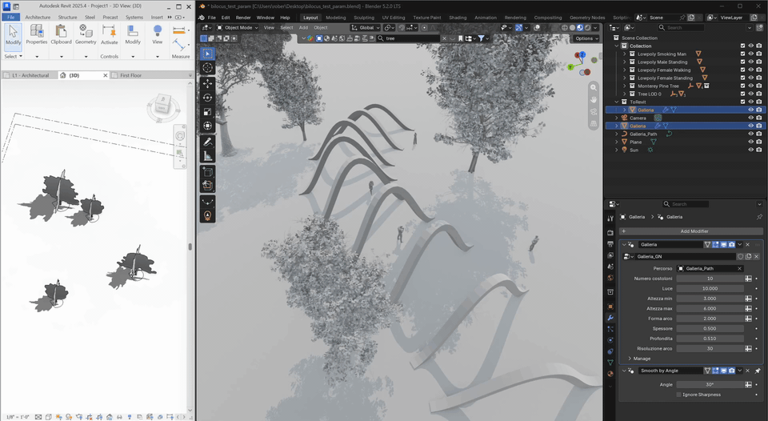
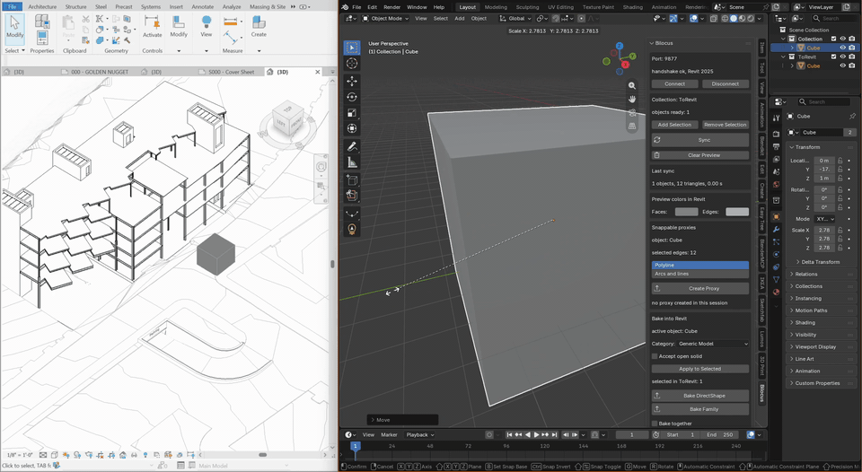
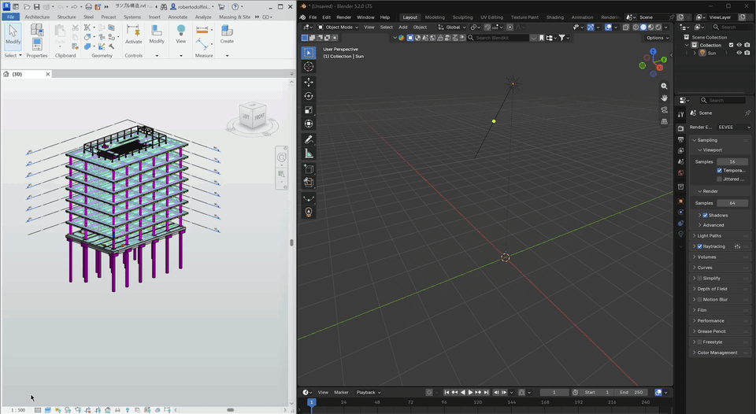
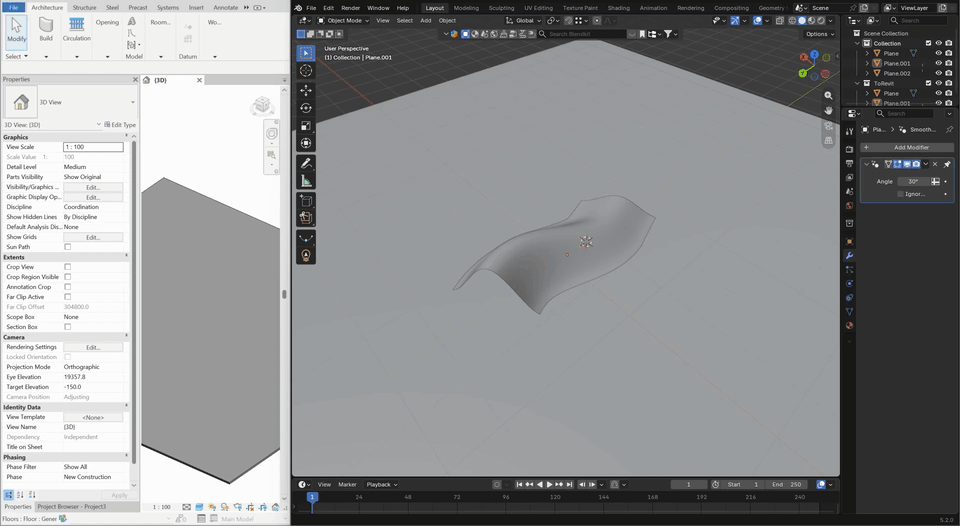
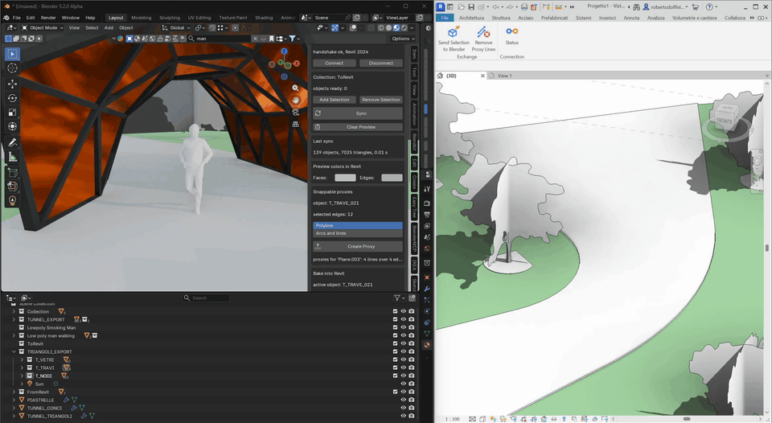
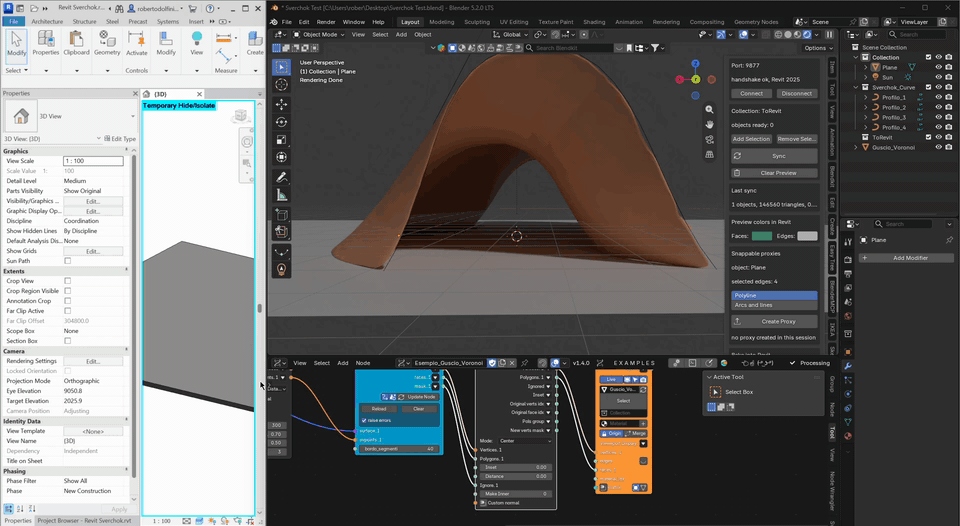

<h1 align="center">
  <picture>
    <source media="(prefers-color-scheme: dark)" srcset="docs/images/logo-dark.svg">
    
  </picture>
</h1>

<h3 align="center">In Blender and Revit at once.</h3>

<br>

<p align="center">
  
</p>

Live bridge between Blender and Autodesk(R) Revit(R) software: the geometry
modeled in Blender is visible inside Revit in real time, without becoming
an element of the document.

The idea is to have something that works like the Grasshopper preview in Rhino.Inside.
It is not exactly an exporter or a file converter: it is a live channel between two
separate programs running on the same computer.

Bilocus is a free and open source independent project, not affiliated with nor
endorsed by Autodesk or the Blender Foundation.


## What it does

- **Live preview, Blender -> Revit.** Put objects in the Blender collection
  `ToRevit`, press **Sync** and the geometry appears in the Revit 3D views.
  Move, rotate or scale an object (in object mode) and Revit follows in real time. The
  preview is graphics only: nothing is added to the Revit model. Face and
  edge colors are set in the Blender panel. After changing the geometry (edit
  mode, modifiers, geometry nodes), press **Sync** again: modifiers are sent
  as they are, no need to apply them. The preview stays in Revit even
  after Blender is closed: remove it with **Clear Preview**, in the Blender
  panel or in the Revit ribbon.

  
- **Selection pull, Revit -> Blender.** Select elements in Revit and press
  **Send Selection to Blender**: they arrive in the `FromRevit` collection,
  with openings in the right place. Sending again updates them in place.

  
- **Snappable proxies.** Select edges of a Blender mesh in edit mode, go back to object mode and press
  **Create Proxy**: Revit gets real model lines (straight or arcs) that you
  can snap to and use as references. Remove them all with **Remove Proxy
  Lines** in the Revit ribbon.

  
- **Bake.** When a shape is final, bake it into the Revit model as a
  **DirectShape** or as a loadable **family** (`BL_<name>`), with the Revit
  category of your choice. With **Bake together** checked, all the selected
  objects go into one family (useful, for example, to create different LODs of a family),
  named after the active object. Baking again
  replaces the previous version; **Remove Bake** deletes what Bilocus
  created. A DirectShape can also arrive as a smooth mesh instead of a
  solid: see [Smooth meshes or true solids](#smooth-meshes-or-true-solids).

  

Reference measurement: 385 objects and 1,042,674 triangles synced in 2.5 s on an ASUS ROG Strix G16 (RTX 5080).

## Smooth meshes or true solids

A DirectShape bake can bring a shape into Revit in two ways, chosen per
object with the **Smooth mesh (no volume)** checkbox:

| | True solid (default) | Smooth mesh |
|---|---|---|
| Look in 3D | every face edge drawn: a subdivided surface shows its triangles | smooth, no face edges |
| Cut and filled in section | yes | yes, if the mesh is closed |
| Dimensions | yes | no |
| Volume, joins, voids | yes | no |
| Bake as a family | yes | no, a family needs a solid |

Use the solid when the shape has to be dimensioned or for accurate volume extraction, the smooth
mesh when it has to be seen: presentation views, renders, context.

Below, a Voronoi shell built with
[Sverchok](https://github.com/nortikin/sverchok) and baked twice side by
side, then cut and dimensioned in section.



## What you can build

Bilocus is a bridge: if Blender can show it as a mesh, Revit can receive it, as a live preview while you work, as proxies to
snap to, as a DirectShape or a family when it is final.

That opens Revit to everything Blender can model:

- **Geometry nodes.** Parametric shells, facade patterns, lattices,
  scattered elements: change a parameter in Blender and see the result in
  the Revit model.
- **Sculpting.** Terrain, organic forms, free surfaces that no Revit tool
  can draw.
- **Modifiers.** Arrays, bevels, booleans, subdivision, curves along paths.
  Bilocus sends the evaluated shape: nothing needs to be applied first.
- **Other add-ons.** Anything that produces a mesh in Blender can end up in
  Revit the same way, for example: [Tissue](https://github.com/alessandro-zomparelli/tissue)
  for tessellations and lattices, [Sverchok](https://github.com/nortikin/sverchok)
  for node-based parametric design, building and landscape generators,
  scanned or photogrammetry models, even geometry built with [Bonsai](https://bonsaibim.org) can be brought in.


## Why Bilocus?

As an architect, I've always found myself caught between two worlds: Revit and Blender. On one side there's Blender, an extremely versatile and malleable tool where you can create whatever comes to mind using geometry nodes, sculpting, and precise editing tools. On the other side there's Revit: parametric, strict, and precise, but inherently limited when it comes to "freeform" exploration.

I've been creating in Blender since version 2.46, long before becoming an architect. Over the years, it became my creative canvas and primary playground. Revit came later, in 2017, as I was finishing university, and ever since, my dream has been to connect the two and get the best of both worlds.

For years, my workflow meant constantly jumping back and forth: DXF exports from Blender, FBX imports into Revit, and sometimes a detour through Rhino, Grasshopper and Rhino.Inside, one more program just to connect the other two.
But this workflow was slow and clunky. Half the time I would wait for a re-import just to check a detail, only to discover missing faces, flipped normals, or import errors.

I needed something lightweight, fast, and reliable: a tool to preview geometry from Blender inside Revit in real time, and easily extract Revit geometry for faster prototyping and rendering.

Bilocus was built to solve this exact pain point.

Thanks to Claude Code, I finally had the opportunity to build this workflow by designing, prototyping, and testing an open-source live channel to bridge the gap between Blender and Revit.

## Requirements

- Autodesk Revit 2024 or 2025 (more version support coming soon)
- Blender 5.1 or 5.2 (more version support coming soon)
- For **Bake Family** only: the English (`Metric Generic Model.rft`) or
  English-Imperial (`Generic Model.rft`) Revit family template library.
- Windows. Both programs run on the same computer and talk over a local
  connection (localhost, port 9877): nothing leaves your machine, everything stays local.

## Installation

Download the zip files from the latest
[Release](../../releases/latest).

**Revit add-in**

1. Close Revit.
2. Unzip `Bilocus-Revit2024.zip` or `Bilocus-Revit2025.zip` (the one that
   matches your Revit) into
   `%AppData%\Autodesk\Revit\Addins\2024` (or `\2025`). You should get the
   file `Bilocus.addin` and the folder `Bilocus` side by side.
3. Start Revit and accept the add-in when Revit asks. A **Bilocus** tab
   appears in the ribbon.

If Revit reports that it cannot load the add-in, right-click the downloaded
zip, open *Properties*, tick *Unblock*, then unzip it again.

**Blender add-on**

1. In Blender open *Edit > Preferences > Add-ons*.
2. From the menu at the top right choose *Install from Disk* and pick
   `Bilocus-Blender.zip` (do not unzip it).
3. Enable **Bilocus**. The panel is in the 3D Viewport sidebar (`N`),
   tab **Bilocus**.

## Quick start

1. Open a project in Revit and a 3D view.
2. In Blender, create some mesh objects, select them and press **Add Selection**: they
   go into the `ToRevit` collection.
3. Press **Connect**, then **Sync**. The geometry appears in the Revit 3D
   view. Move an object in Blender and watch it move in Revit.
4. Changed the shape? Press **Sync** again. Transforms are live, geometry
   is sent only when you ask: that is what keeps big models fast.

The connection is always manual: Bilocus never reconnects on its own. If
the connection drops, the panel says so.

## Known limits

- The preview is DirectContext3D graphics: it cannot be selected, snapped
  to, scheduled, printed or exported, and it does not cast shadows. When
  you need any of that, use **Create Proxy** or **Bake**.
- The preview shows only in 3D views. For plan or elevation, use a 3D view
  with an orthographic top or front orientation. (A proper preview in plan
  and section views is being studied.)
- Blender and Revit share Revit's internal origin. Project Base Point and
  Survey Point are not used: keep the model near the origin.
- Keep the Blender scene **Unit Scale** at 1.0 (*Scene Properties > Units*):
  Bilocus reads one Blender unit as one meter. The length unit shown in
  Blender (m, cm, mm) does not matter.
- One Blender at a time. A second Blender that connects while the first is
  still connected gets no answer from Revit (its panel never shows
  *handshake ok*) and can freeze on Sync: press **Disconnect** in the first
  one before connecting another.
- Sync refuses to run while an object is in Edit Mode: press Tab first.
- In Blender, `Shift+D` also copies the Bilocus identifier of an object.
  Bilocus detects the duplicate at the next Sync and gives it a new one. Keep an eye on the `ToRevit` collection because that's
  what will be synced.
- With **Bake together**, the objects other than the active one live inside
  the active object's family. **Remove Bake** or a bake of one of them on
  its own does not take it out of that family: bake the active object again
  without it, or use **Remove Bake** on the active object.

## Building from source

```powershell
tools\deploy-revit.ps1 -RevitVersion 2025   # builds and installs the add-in; refuses to run with Revit open
tools\deploy-blender.ps1 -BlenderVersion 5.2  # installs the Blender add-on
```

Requires the .NET SDK. The Revit project is multi-target (`net48` for Revit
2024, `net8.0-windows` for Revit 2025). Tests: `dotnet test Bilocus.sln`
and `python -m pytest` in `tests/python`.

**Restart Blender after deploying the add-on.** Disabling and re-enabling
it does not reload the modules already imported.

Architecture and wire protocol are described in [DESIGN.md](DESIGN.md).

```
src/Bilocus.Protocol/   message framing and codec
src/Bilocus.Geometry/   mesh payload and chunking
src/Bilocus.Revit/      Revit add-in: server, preview, proxy, pull, bake
src/blender_addon/      Blender add-on
tests/                  xUnit (.NET) and pytest (Python)
tools/                  deploy scripts
```

## Support

I know how hard it is, especially as a student or a junior architect just
starting with Revit, to find a free add-on that does what you need: I have been
there myself. That is
why Bilocus is free for everyone, and it will stay free forever.

If you use it professionally, it saves you time and you'd like to support the
project, you can [buy me a coffee](https://buymeacoffee.com/archrobertodl)!
It is entirely voluntary and gives nothing extra in return.

## Credits

I designed Bilocus and followed every step of its development, building it
together with Claude Code. Architecture, design decisions, testing and
review were human-driven; the code was written by Claude Code and verified
together.

Found a bug or want a feature? Open an [issue](../../issues)!

## Terms of use

By installing or using the Bilocus add-in for Revit you agree to the
[Terms of Use](TERMS-OF-USE.md), which include the
[Autodesk Acceptable Use Policy](https://www.autodesk.com/company/terms-of-use/en/acceptable-use).
Bilocus does not collect or transmit any data: everything stays on your
computer.

## License

- Blender add-on: [GPL-3.0-or-later](LICENSES/GPL-3.0-or-later.txt)
- Revit add-in and everything else: [MIT](LICENSES/MIT.txt)

Details in [LICENSE.txt](LICENSE.txt); third-party components in
[THIRD-PARTY-NOTICES.txt](THIRD-PARTY-NOTICES.txt).

Autodesk and Revit are registered trademarks or trademarks of Autodesk,
Inc., and/or its subsidiaries and/or affiliates in the USA and/or other
countries. Blender is a registered trademark of the Blender Foundation.

Copyright (c) 2026 Roberto Dolfini.